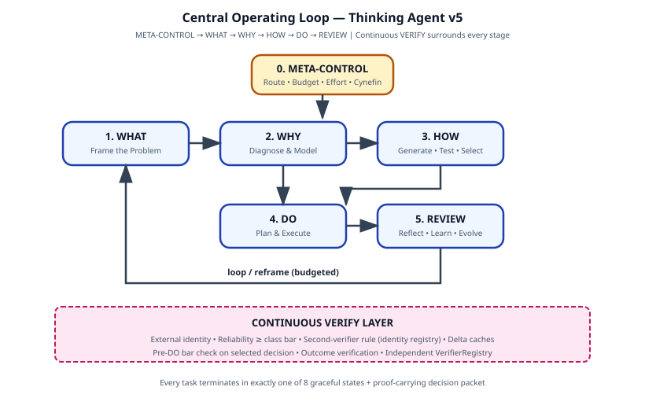
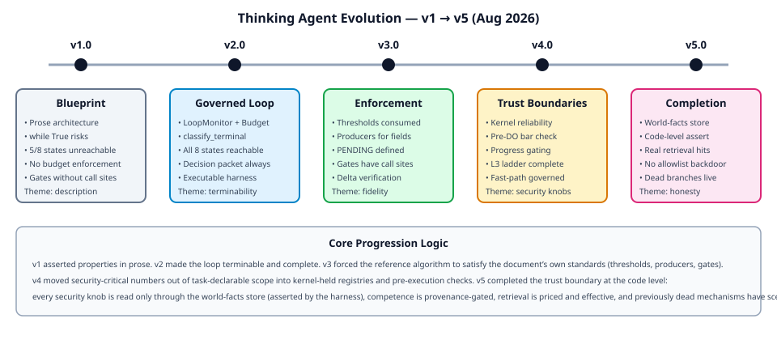
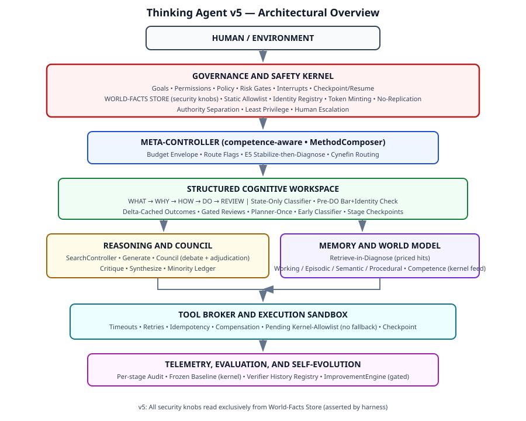
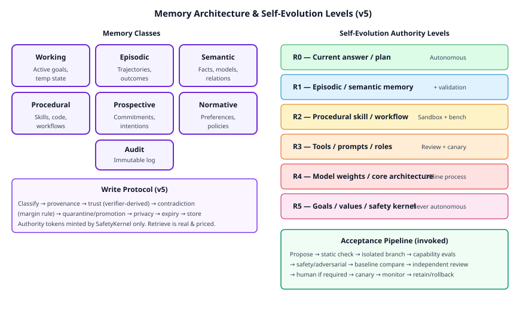
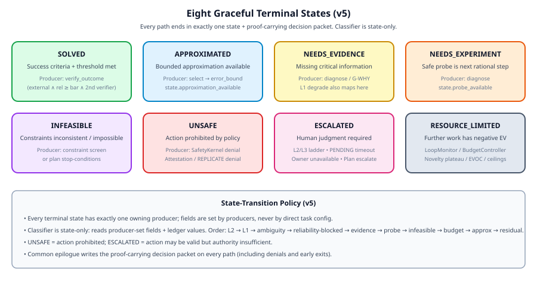

# 思考型智能體

## 一個適用於廣泛問題求解與 AGI/ASI 研究之通用、可治理的人工智能思考模型

**涵蓋版本 1.0 至 5.0 之書籍版**  
**研究截止日期：** 2026 年 8 月 7 日  
**資料來源政策：** 優先採用 arXiv 論文及 xAI 官方文件，而非第三方評論。

## 序言

本書呈現 **Thinking Agent** 的完整演變歷程與最終架構——這是一份針對受管治認知系統的研究及工程藍圖，旨在作為 AGI/ASI 研究的基礎框架。它**並非**宣稱當前語言模型已達 AGI，亦非主張多代理辯論、較長推論或遞迴自我修改即可自動產生通用智能或安全超智能。

核心論點為乘法性關係：

```text
Foundation-model capability
× adaptive cognitive control
× grounded world interaction
× structured memory
× planning and search
× independent verification
× continual learning
× safety and governance
```

任何因素出現嚴重缺陷，均會限制整體效能。因此 Thinking Agent 將生成、真值判定、安全判定、執行、學習及系統變更分拆為不同擁有者，使其無法被壓縮為單一無限制模型呼叫。

文件歷經五個主要版本。每個版本均經過多角度自我審查，而自 v2 起，更配備可執行驗證工具，凍結前一版本演算法作為基線，並斷言框架自身標準。此進程並非「增加功能」，而是逐步縮小文件聲稱與參考演算法實際執行之間的差距。

本書：

1. 敘述每個版本之間的變更，附以促成變更的具體缺陷，以及接納該等變更的理由。
2. 提供最新（v5）架構的詳細獨立解釋。
3. 嵌入架構圖作為 SVG 插圖。
4. 將操作規則、失效模式、發展路線圖及驗證結果整合為單一連貫敘事。

## 第一章 — 何謂思考代理（Thinking Agent）

### 1.1 目的與非聲明

思考代理（Thinking Agent）旨在處理廣泛的問題類別——清晰／例行、複雜／專家、複雜適應、混亂／危機、因果診斷、科學發現、創意設計、策略規劃、軟件運作、具身行動、社會／利益相關者、對抗性、長時程學習，以及架構改進——透過選擇不同的推理程序，而非應用單一固定提示。

在此脈絡下，「通用問題解決」（universal problem solving）指系統能夠識別問題類別，並回傳最負責任的可用結果：

- 已驗證的解決方案（`SOLVED`）
- 有限近似（`APPROXIMATED`）
- 排序後的替代方案
- 缺少證據的請求（`NEEDS_EVIDENCE`）
- 安全的實驗／探測（`NEEDS_EXPERIMENT`）
- 不可行性的證明（`INFEASIBLE`）
- 經校準的不確定性
- 當行動可能不安全時的拒絕或人工升級（`UNSAFE` / `ESCALATED`）
- 明確的資源耗盡（`RESOURCE_LIMITED`）

每項任務必須以這八種狀態之一結束，並必須產生帶有證明的決策封包。

本架構**並不**聲明：

- 現有模型為通用人工智慧（AGI）。
- 多代理辯論必然優於強大的單一代理。
- 自我反思可取代外部驗證。
- 更多推理時運算資源總能改善答案。
- 僅靠提示即可使遞迴自我改進變得安全。
- 已發現通用知識表示。
- 基準分數證明一般智慧。
- 僅透過擴大模型規模或代理數量，即可安全獲得人工超級智慧（ASI）。
- 參考演算法或其測試平台證明上述任何一項。測試平台僅驗證控制流程屬性。

### 1.2 核心運作循環

```text
META-CONTROL → WHAT → WHY → HOW → DO → REVIEW
```

一個持續運作的 **VERIFY** 層環繞每個階段。一個 **受控循環**（LoopMonitor、BudgetController、階段閘門、狀態專屬分類器、差異驗證、檢查點／恢復、進度閘門）確保運作終止、優雅失效及成本受控。



*圖 1. Thinking Agent v5 的核心運作循環。VERIFY 層持續運作；循環受預算限制並受到監控。*

### 1.3 設計原則（節錄）

| # | Principle | Core idea |
|---|-----------|-----------|
| P1 | Context before cognition | 在選擇程序前，先分類問題、利害關係、不確定性及風險 |
| P2 | Frame → Diagnose → Prescribe | 切勿為錯誤的問題優化解決方案 |
| P3 | Evidence outranks confidence | 流暢性、一致性及自我報告的信心均非證據 |
| P4 | External feedback outranks intrinsic critique | 自我批評僅為假說之源，而非證明 |
| P5 | Independent diversity before social influence | 代理在任何溝通前先行私下生成 |
| P6 | Reversible before irreversible | 優先採用測試、封阻、撤銷及補償措施 |
| P7 | Verification scales with consequence | 高利害的短時行動可能需要更深入的驗證 |
| P8 | Memory requires governance | 出處、信任、矛盾處理、權限及期限 |
| P9 | Self-improvement empirical & reversible | Sandbox → evaluate → review → canary → rollback |
| P10 | Preserve human authority | 目標、權限、安全核心（Safety Kernel）置於一般自我修改之外 |
| P11 | Stop when EV is negative | 新穎性高原、EVOC、硬性預算 → `RESOURCE_LIMITED` |
| P12 | Packet on every path | 共同結語；不容許無聲否認 |

此等原則並非僅供參考。在 v5 中，每項原則均對應參考演算法中具名之執行元件及呼叫位置。

## 第二章 — 演變：每個版本改動的原因

變更日誌（各版本的 §31）為主要來源。以下為發現的缺陷、已接受的改動及其原因的敘事綜合。

### 2.1 版本 1.0 — 研究藍圖（散文）

**狀態：** 研究及工程藍圖。未具備可執行框架。

v1 整合內容包括：

- 40 個傳統思考框架的排序組合（Cynefin 排名最高，其後依次為 Premortem、AAR、Double-Loop、RPD、根本原因分析系列……）。
- WHAT → WHY → HOW → DO → REVIEW 流程。
- 早期草稿中提出的記憶、多代理、元認知及自我演化概念。
- 當代代理研究（CoALA、ReAct、Tree-of-Thoughts / RAP / LATS、Reflexion / CRITIC、多代理辯論文獻、STOP / Darwin Gödel Machine、AgentDojo / AI Control）。
- xAI 的生產模式（自適應推理、平行子代理、計劃檢討、驗證、Grok Build 框架元件）。

此版本已列出八個優雅狀態，區分生成／真相／安全／執行／學習／變更，並指出自我批評並非證明。然而，參考演算法為一個 `while True` 迴圈，其終止信號從未被計算，八個狀態中有五個無法達成或已崩潰，預算雖有宣稱但從未執行，階段閘門及 premortem／紅隊並無呼叫位置，決策封包具路徑依賴性（拒絕路徑不回傳任何內容），能力模型亦無資料饋入。簡而言之，文件描述了演算法所不具備的特性。

**已確認的主要限制：**「以散文宣稱」與「由控制流程執行」並不相同。

### 2.2 版本 2.0 — 受控循環

**主題：** 可終止性、狀態完整性，以及可執行的驗證測試套件。

主要已接納的發現（A1–A18）：

| 缺陷（v1） | 變更（v2） | 原因 |
|-------------|-------------|--------|
| `while True` 無計算停止條件 | LoopMonitor（新穎度、重複、EVOC）+ 有界循環 | 必須保證終止，而非依賴希望 |
| 8 個狀態中有 5 個無法到達 | `classify_terminal` 決策表及具名生成器 | 每個優雅狀態都必須有生成路徑 |
| 工作量層級從未分流 | 路由旗標（`requires_*`）及 E0/E1 的快速路徑 | 必須實現自適應工作量 |
| 預算已宣告但從未執行 | BudgetController 在每個階段皆被調用 | 成本必須作為一等約束條件 |
| 閘門／事前分析／紅隊無呼叫位置 | 明確呼叫位置 + `check_exit_gate` | 沒有呼叫位置的機制只是一段文字 |
| REVIEW 位於循環之外；VERIFY = 兩個點 | 循環內 AAR + 持續驗證層 | 學習與驗證必須持續進行 |
| 決策封包路徑依賴 | 每條終端路徑皆有共同結語 | 避免靜默拒絕 |
| 議會／記憶／自我演化不完整 | 結構獨立性、矛盾規則、准入控制 | 使多代理與記憶協議可實作 |

**驗證：** 第一個測試套件。v1 與 v2 使用相同模擬進行比較。v1 經常觸發看門狗無限循環；v2 則在每個場景皆以優雅狀態終止。所有八個狀態均已到達。在病態案例中，因循環現已可停止，權杖成本大幅下降。

**跳躍原因：** 無法終止或無法產生所承諾狀態的研究藍圖，尚未成為可靠的工程物件。v2 使控制流程與所述合約相符。

### 2.3 版本 3.0 — 執行保真度

**主題：** 演算法必須符合文件本身所訂立的標準。

版本 2 仍然存在若干缺陷，而測試架構（harness）本身亦揭示了這些問題：

- 類別門檻（§15.4）並無消費者；任務在種子可靠性 0.5 時即被宣告為 `SOLVED`。
- 虛設欄位（`probe_available`、`approximation_available`、`infeasible`）雖被分類器讀取，但從未有任何生產者寫入，且亦不存在於模式（schema）之中。
- PENDING 授權形成無限重複執行迴圈。
- 若干階段閘門仍欠缺呼叫位置。
- 能力迴圈懸空未接。
- 議會（Council）仍為註釋而非分支。
- 成本削減歸因錯誤（「69 %」中大部分來自終止兩個無限迴圈，而非快速路徑）。

版本 3 已修復上述問題（B1–B17）。為分類器的每項輸入加入了生產者；可靠性門檻成為 `verify_outcome` 內部的真實謂詞；PENDING 獲得靜態允許清單子集、單次執行守衛，以及升級逾時機制；階段閘門與計畫條件已獲取呼叫位置；議會成為真正分支，並寫入少數派分類帳；WHY 閘門之後的早期分類器進入可避免浪費完整流程；增量驗證與進度感知開始出現。

**驗證：** 26 個場景。版本 2 基線 98/98 項斷言 → 版本 3 111/111 項。認知權杖由 592 降至 393（−33.6 %）。成本削減歸因已更正：先前大幅節省主要來自迴圈終止；餘下節省則來自提前退出與增量重用。

**理由：** 文件所印列的門檻，若其演算法本身卻置之不理，則有欠誠實。版本 3 已修補最顯著的「印列與執行」差距。

### 2.4 版本 4.0 — 信任邊界執行

**主題：** 影響安全與真實性的數值，不得由任務宣告。

即使經歷 v3，仍有若干影響安全與真實性的控制參數，仍在任務（或自我評估模型）的影響之下：

- 驗證器可靠性仍可受任務提供的「溫和度」影響。
- 能力更新仍由自我產生的校正資料驅動。
- PENDING「子集」仍部分由規劃器虛構。
- 外部行動任務仍可走快速路徑並跳過證明。
- 類別閾值在某些路徑上於執行後才進行檢查。
- 無驗證器階梯的 L3 在實際上無法到達。
- WHY 閘門無法強制重新診斷；計劃升級條件未被讀取。

v4 將可靠性移至由滾動歷史、來源閘控能力所驅動的內核端登錄檔；以真正的內核表取代預留位置的允許清單；強制外部行動任務離開快速路徑；在任何執行前先行完成證明與閾值檢查；完善 L1/L2/L3 階梯；令 WHY 閘門可重新評估；讀取計劃升級條件；執行第二驗證器規則；並啟用先前未用的 E5（混沌）及搜尋分支。

**驗證：** 36 個場景。v3 141/141 → v4 153/153。認知成本幾乎持平（560 → 547），因為新增檢查增加了工作量；此乃換取更強執行力的真實權衡。

**理由：** 若系統允許任務（或受益模型）自行設定其可靠性、能力或允許清單，即不受治理。信任邊界必須為結構性設計。

### 2.5 第 5.0 版 — 信任邊界完善

**主題：** 核心持有為程式碼而非敘述；先前失效的機制現已生效或已明確披露。

v4 仍遺留若干信任漏洞及死碼：

- 安全控制仍可從引擎主體內的任務範圍結構讀取（敘述為「核心持有」）。
- 能力仍可受任務宣告的準確度影響。
- `allowlist_hint` 後備機制允許未列入清單的任務。
- 第二驗證規則仍部分由任務標記驅動。
- L3 僅透過早期分類器啟動，從未在認證時對認證類別啟動。
- 記憶體檢索為唯寫模式（0 次命中）。
- 結果驗證、迴圈內審查及規劃器未設進度閘門；未變更狀態亦會重複計費。
- 若干已宣稱的分支（擁有者不可用、G-WHY-4/5、新穎性高原對應、REPLICATE 拒絕）並無對應場景。

v5 已解決上述問題：

- **世界事實存放區。** 所有安全控制（`pending_timeout`、`calls_ceiling`、EVOC 參數、校準、身分、停運、基準凍結、寫入授權）**僅**透過世界物件讀取。每次執行 harness 套件時均會運行程式碼層級的 `assert_read_path()`。S45 展示任務宣告準確度為 1.0 時仍會被忽略。
- 能力僅由具備出處閘門的核心領域準確度登錄檔提供。
- PENDING 子集 = 僅限核心表格成員；負面場景 S38。
- 第二驗證規則由身分登錄檔計算；前置 DO 區塊；負面場景 S39。
- L3 在認證時對認證類別啟動（S29）。
- 檢索為真實運作，按命中計費，查詢任務衍生詞彙，並可填補缺口（S34/S40）。
- 結果差異快取 + 閘門審查 + 規劃器單次執行（V7）。
- 先前失效的機制已獲場景（S41–S44）；高原正確對應 `RESOURCE_LIMITED`；E5 接收穩定後診斷通道；欄位檢查針對**選定**決策的驗證器，而非候選最大值。

**驗證：** 44 個場景。v4 基準 177/177 → v5 187/187。認知符元 616 → 592（−3.9 %）。節省來自閘門／快取／提前退出；成本來自新啟用的機制（真實檢索、L3 路徑等）。每場景均已發表歸因。

**原因：** 未由引擎讀取路徑強制執行的「核心持有」仍屬敘述。從未執行的機制仍屬段落。v5 使餘下宣稱要麼為程式碼真實反映，要麼明確披露為 Phase-N。



*圖 2。從散文藍圖（v1）演進至程式碼層級信任邊界完善（v5）。*

## 第三章 — 思考代理 v5 之架構（詳解）

### 3.1 高層次結構



*圖 3。Thinking Agent v5 的嵌套式架構。Safety Kernel 位於普通認知框架之外，並擁有世界事實庫。*

本系統依據四種嵌套的時間尺度進行組織：

1. **行動循環** — 具備交易語義的單次工具呼叫／觀察。
2. **任務循環** — META → WHAT → WHY → HOW → DO → REVIEW 週期，並設有各階段檢查點。
3. **學習循環** — 能力更新（由 Kernel 提供、依出處受控）、記憶鞏固、改進建議。
4. **架構演進循環** — 在 R0–R5 權限等級下受控的框架搜尋，始終對照凍結基線。

### 3.2 第 0 階段 — META-CONTROL

職責：

- Cynefin 情境分類（明確 / 複雜 / 錯綜複雜 / 混亂 / 無序）。
- 努力程度選擇（E0–E5）。E5 會強制啟動理事會（council）及人工階段閘門，並執行一次 **stabilize-before-diagnose** 流程（Cynefin 行動→感知→回應）。
- 路由旗標：`requires_diagnosis`、`requires_search`、`use_council`、`requires_review`、外部行動閘門等。
- 預算範圍分配（迭代次數、符元、呼叫次數、每輪代理數、截止期限）。
- 能力感知路由（根據領域過往成功／失敗紀錄，由 kernel 提供）。
- MethodComposer 根據任務特徵選取推理模組。

所有與安全相關的上限及種子均從 **world-facts store** 讀取，而非來自任務宣告。

### 3.3 階段 1 — WHAT（框架建立）

- 製作問題框架，包含成功指標、限制條件、持份者及負責人。
- 閘門謂詞（G-WHAT）：指標已列明、負責人已到位或已升級、框架具連貫性。
- 負責人無法到位 → `ESCALATED`（現已通過情境驗證）。
- 閘門重入不受新穎性停滯條件限制（此為外部等待）。

### 3.4 第二階段 — WHY（診斷）

- 假說形成**之前**進行記憶檢索（按命中次數計價；空值則免費）。
- 假說生成、證據收集、反證搜尋、剩餘不確定性。
- 資訊價值（VOI）估算；可填補的缺口實際上會透過檢索填補，而非僅留下標記。
- G-WHY 謂詞（全部五項均須評估）：
  1. 主導假說具備與決策相關的證據
  2. 已考慮重要替代方案
  3. 已記錄剩餘不確定性
  4. 進一步診斷的預估資訊價值（VOI）≤ 成本
  5. 反證證據非空
- 閘門失敗會清除假說並重新進入（計入預算）。
- 當結果已確定時提前進入分類器（例如 `missing_evidence` 無法填補、`probe_available`、低風險情境下的驗證器中斷等）。

### 3.5 階段三 — 如何（生成／測試／選取）

- MethodComposer 加上可選的 SearchController（探索閘門的期望值）。
- 獨立候選生成（當使用理事會時，採用全新上下文）。
- 預後分析與紅隊審查——依進度分閘（僅適用於新內容）。
- VerifierRegistry：外部身分、來自核心註冊表／滾動歷史的可靠性、依身分計數而定的第二驗證者規則。
- **對已選定決策進行 DO 前檢查：**
  - 證明（行動類別、REPLICATE 拒絕等）
  - 與**已選**候選項之驗證者進行類別比較（而非集合最大值）
  - 第二驗證者要求
- 約束篩選 → `infeasible` 產生器。
- 選取時，若近似為目前最佳可用方案，則記錄 `error_bound`。

### 3.6 第四階段 — DO（規劃與執行）

- 具停止及升級條件的階層式計劃（兩者均已耗用）。
- SafetyKernel 授權：
  - 完全核准、拒絕（`UNSAFE` / `ESCALATED`），或待定。
  - 待定狀態僅執行內核靜態允許清單子集（A2 類別，僅限表格成員 — 無任何後備）。
  - 待定等待狀態為進度閘門控制（每次迭代約 0 認知符記），並由內核持有的逾時上限所界定 → `ESCALATED`。
- ToolBroker：模式、最小權限、交易語義、冪等鍵、補償表、逾時／重試。
- 透過版本化檢查點進行當機／恢復（第一階段完整性邊界已披露）。
- L3（無行動）在驗證者中斷期間，於證明時刻為外部 A3+ 任務觸發。

### 3.7 第五階段 — REVIEW（反思／學習／演變）

- 行動後檢討（預期 → 實際 → 差異 → 改進）。
- 單環學習（戰術層面）與雙環學習（假設／框架層面）；後者可觸發任務進行中的重新定義。
- 檢討為**閘門控制**：僅在候選結果／觀測值出現差異時於循環內進行；僅當已作出決策、執行行動或可提煉教訓時方於結語階段進行。
- 能力更新每回合僅進行一次，且僅依據 kernel 與 EvaluationPlane 之來源。
- 程序性寫入需由 SafetyKernel 發行之授權令牌。
- ImprovementEngine：先執行准入控制與重複刪除，隨後於授權後按凍結基準執行完整接受管線。

### 3.8 持續驗證層

- VerifierRegistry 擁有身份與可靠性；模型不得標記「外部」。
- SOLVED 要求：檢查通過 ∧ 外部身份 ∧ 可靠性 ≥ 分類門檻（以 max(attested, declared) 為鍵，未知值 → A5）∧ 必要時執行第二驗證器規則。
- 候選項目與結果驗證皆使用 Delta 快取（SHA-256）。
- 任何低於門檻的驗證結果均不得執行行動。

### 3.9 記憶架構



*圖 4. 記憶類別與 R0–R5 自我演化權限階梯。*

寫入協定乃完整決策程序：分類 → 出處 → 信任（源自驗證器可靠性）→ 矛盾（信任餘裕規則）→ 隔離／提升 → 私隱／權限 → 到期 → 儲存。檢索於診斷過程中處於活躍狀態，並按結果計價。

### 3.10 安全核心（Safety Kernel）（位於支架之外）

擁有：

- 目標接納及已簽署的目標合約
- 權限及能力權杖
- 世界事實儲存（所有安全控制項）
- 靜態允許清單及動作類別分類法
- 身份登記冊
- 權杖鑄造
- 證明及 REPLICATE 拒絕
- 人工閘門及 PENDING 逾時
- 中斷／關閉
- 自我修改等級閘門（R0–R5）

不變式包括：系統不得自行授予新權限；未受信任的內容不得更改管治指令；高影響動作需要獨立授權；日誌記錄不得停用；核心目標不得被自主重寫；未經評估的自我修改不得部署；安全關鍵變更需要人工核准；自我複製及無控制的資源取得預設為停用。

### 3.11 優雅狀態（再探討）



*圖 5. 八個終端狀態、其產生者，以及僅限狀態的分類器策略。*

### 3.12 參考演算法保證（v5）

1. **終止條件** — 迭代／權杖／呼叫預算、新穎性高原 → `RESOURCE_LIMITED`、重複、EVOC；外部等待豁免但仍受超時限制。
2. **狀態完整性** — 所有八個狀態均可透過世界事實驅動的產生器到達。
3. **封包完整性** — 每個終端路徑，包括拒絕與提前退出。
4. **驗證獨立性** — 外部身份＋閾值＋第二驗證器；可靠性由核心持有；低於閾值之執行不被允許。
5. **成本有界性** — 封套＋進度閘門＋單次規劃＋結果快取＋付費檢索。
6. **閘門執行** — WHAT/WHY/HOW 及計劃條件；WHY 可重新評估。
7. **迴圈內審查** — 受閘門控制的 AAR；每場次僅進行一次能力審查，並將結果回饋核心。
8. **恢復機制** — 階段邊界檢查點；冪等重新執行保護。

## 第四章 — 驗證紀律

自 v2 版本起，此框架遵循其自身規則：**自我批判是假設的來源，而非證明**。每一項被接受的變更，均於相同確定性模擬組件上，對前一演算法的凍結基準執行。測試工具套件驗證框架本身的標準（終止、狀態可達性、預算執行、階段閘門、閾值執行、封包完整性、獨立性等）。測試工具套件**不**宣稱測量模型智能。

### 4.1 主要成果（v5 測試套件）

| 指標 | v4（基準版） | v5 |
|------|--------------|-----|
| 場景數 | 36（後續增加） | 44 |
| 斷言 | 177/177 | 187/187 |
| 認知代幣 | 616 | 592（−3.9 %） |
| 確定性 | 3 次運行結果一致 | 3 次運行結果一致 |

值得注意的行為變化：

- S26：帶有兩個身分之 identity-registry A4 現已正確達到 SOLVED。
- S34/S40：實際檢索填補空白 → SOLVED。
- S29：L3 在證明時刻達成。
- S38/S39：allowlist 與 second-verifier 之否定案例。
- S41–S44：先前無效分支現已生效。
- S45：任務所聲明之能力準確度被忽略。

### 4.2 誠實限制（始終重申）

- 僅為模擬元件；提供控制流程保證，而非智慧。
- 若干 Phase-N 功能仍處於設計層面（EvaluationPlane 批次處理、探測器生命週期、多輪辯論、檢查點 HMAC 完整性邊界、`renegotiate` 部署等），並已在披露中列明。
- World-store **讀取路徑** 已強制執行；生產環境之 **寫入路徑**（誰可填充該存放區）屬 Phase-1 程序／金鑰邊界。
- 新穎性簽章仍屬啟發式方法；硬性預算為終止機制之最後保障。
- Harness 內之驗證器歷史記錄使用永遠正確之裁決；實際校準動態需依賴真實評估結果。

## 第五章 — 發展藍圖、最低可行產品及運作規則

### 5.1 最小可行思考代理（排序）

1. 結構化任務狀態及決策記錄。
2. 證據檢索與來源證明。
3. 特定準則驗證（外部與基準）。
4. 交易式工具使用與最小權限。
5. 具備檢索與寫入協議的持久記憶。
6. 獨立多代理生成與少數派記錄。
7. 針對性辯論／裁決。
8. 安全性與提示注入評估；世界事實儲存庫。
9. 以基線為閘門的程序記憶更新。
10. 沙盒化架構搜尋（第五階段之預留功能）。
11. 完整 EvaluationPlane 凍結程序。

### 5.2 分階段路線圖（摘要）

| 階段 | 重點 |
|-------|--------|
| 0 | 結構化助理（路由、階段、確定性驗證、LoopMonitor） |
| 1 | 具基礎的智能體（工具中介、沙盒、人類核准的行動、世界存儲寫入邊界、檢查點完整性） |
| 2 | 持續性通才（長期記憶、能力校準、EvaluationPlane 批次處理、共同擴展閘門、重新協商） |
| 3 | 集體求解器（異質專門化系統、大規模並行工作流程） |
| 4 | 持續學習者（主動課程、探測生命週期、多模態世界模型） |
| 5 | 受治理的自改進系統（支架搜尋、金絲雀測試、獨立安全審計） |
| 6 | AGI 候選系統（廣泛遷移能力、低資料學習、長時程自主性、校準不確定性、穩健中斷機制、在資源限制下的安全持續改進之證據） |
| 7 | ASI 研究邊界（對超越人類專家系統的監督；禁止不受控制的複製、禁止自主目標重寫、能力與安全共同擴展） |

### 5.3 最終運作規則（v5）

1. 先感知再深入思考。
2. 先框架化再診斷。
3. 先診斷再開方。
4. 先產生替代方案再作出承諾。
5. 先測試假設再採取行動。
6. 偏好證據而非共識。
7. 偏好外部查核而非自我信心。
8. 偏好可逆探測而非不可逆賭注。
9. 僅在多樣性與分解能帶來價值時，才使用多個代理。
10. 保留異議。
11. 將所有檢索內容視為未受信任的數據。
12. 授予所需的最低權限。
13. 驗證環境結果，而非僅驗證生成之計劃。
14. 從結果中學習，而非僅從敘述中學習。
15. 在檢討期間質疑治理假設。
16. 切勿僅因系統提出而部署自我修改。
17. 將目標、權限及安全控制置於普通自我修改之外。
18. 當證據、能力或權限不足時，予以升級。
19. 當額外認知具有負面預期價值時，停止運作。
20. 切勿將通往 AGI 的鷹架與已證明的 AGI 混淆。
21. 每項任務均以優雅狀態結束；每個終端狀態皆附帶決策封包。
22. 無法編列預算的路徑即為無法執行的路徑。
23. 無法指明驗證者之主張並非已驗證之主張——而其可靠性低於類別標準之驗證者，亦非該主張之驗證者。
24. 由主張者書寫之標籤為數據，而非權威——權威令牌乃經鑄造，信任則經測量。
25. 參考演算法未呼叫之機制為段落，而非機制。
26. 任務自行設定之數值並非治理——可靠性、努力類別、上限、逾時及能力回饋均由核心持有。
27. 任何低於標準之驗證均不得執行——標準須於執行前查核。
28. 文件所主張者，測試框架必須證明——每一規範性機制皆具有呼叫位置及場景（或具名披露）。
29. 引擎從任務自身聲明讀取之旋鈕並非核心持有——引擎主體僅透過世界存儲讀取安全旋鈕，而測試框架則聲明該讀取路徑。
30. 缺乏場景之機制即為段落。
31. 切勿為相同工作支付兩次——結果驗證為增量快取，檢討受閘門控制，規劃器每項決策僅建置一次，空檢索免費。

## 第六章 — 常見失效模式與緩解措施（v5）

| 失效模式 | v5 緩解措施 |
|---------|---------------|
| 問題框架錯誤 | 多重框架、用戶確認、框架批評者、WHAT 閘門 |
| 先 HOW 後 WHY | 要求診斷的階段閘門 |
| 自信幻覺 | 外部驗證器 + 可靠性門檻 + 第二驗證器規則 |
| 過度診斷 | VOI 停止 + EVOC |
| 首答錨定 | 獨立候選方案生成 |
| 自我批評迴音室 | 外部／異質驗證器；SOLVED 絕不單靠自我驗證 |
| 辯論從眾 | 先私下作答、新鮮上下文、少數意見記錄 |
| 多數錯誤 | 驗證加權聚合；少數意見可恢復 |
| 規劃者與執行者漂移 | 前置條件、後置條件、檢查點、監控器 |
| 工具幻覺 | 檢索式模式 + 參數驗證 |
| 提示注入 | 權限／資料分離、最低權限、邊界驗證 |
| 記憶污染 | 鑄造式權杖、驗證器衍生信任、隔離區 |
| 目標漂移 | 可變記憶之外的簽署目標合約 |
| 獎勵駭客 | 隱藏／對抗式評估；不可變評估平面 |
| 基準過擬合 | 組合 + 分布外測試；凍結基準 |
| 不安全自我修改 | 啟用完整 §22.3 管線；R5 永不自主 |
| 無限認知迴圈 | LoopMonitor（新穎性 → RESOURCE_LIMITED、預算） |
| 代理過度使用 | 理事會可行性謂詞 + 每回合上限 |
| 隱藏副作用 | 事務性動作、冪等性、補償 |
| 能力增長超越安全 | 共同擴展閘門（階段 2） |
| 無審計拒絕路徑 | 每條路徑的共同結語 |
| 提案洪流 | 准入控制 + 正規去重 |
| 驗證器低於門檻卻靜默 SOLVED | 可靠性封鎖 → ESCALATED；DO 前檢查 |
| 任務宣告能力／可靠性 | 世界事實儲存 + 出處閘門 + assert_read_path |
| 允許清單後門 | 僅限核心表格成員；負面場景 |
| 表面新穎性規避 | 文件化啟發式；硬性預算是保證 |

## 第七章 — 結論

思考代理（Thinking Agent）乃五次連續自我修正之成果。v1 描述了一個豐富的架構。v2 令循環可終止，並使狀態機完整。v3 強制參考演算法遵循門檻值與文件本身所要求的生產者。v4 將安全關鍵數字置於信任邊界之後，並在快速路徑及欄位檢查上封閉治理漏洞。v5 在代碼層面完成信任邊界，使檢索與先前失效的分支成為真實可行，並將每一項剩餘主張提交至情境測試或明確披露。

最重要原則並非「思考更久」或「使用更多代理」。其原則為：

> **應用正確的認知過程，取得正確的證據，通過正確的機制進行驗證，以正確的權限行事，並在不削弱人類控制的情況下學習。**

此組合為日益通用的人工智能系統提供一個實用且可審計的框架，同時將核心研究問題——人工通用智能本身、安全遞歸自我改進及人工超級智能監管——明確保持開放。

## 附錄 A — 主要研究參考文獻

1. Sumers 等，《語言智能體的認知架構》（Cognitive Architectures for Language Agents），arXiv:2309.02427  
2. Kotseruba 與 Tsotsos，《四十年認知架構研究回顧》（A Review of 40 Years of Cognitive Architecture Research），arXiv:1610.08602  
3. Yao 等，《ReAct》，arXiv:2210.03629  
4. Yao 等，《思考樹》（Tree of Thoughts），arXiv:2305.10601；Hao 等，《RAP》；Zhou 等，《LATS》  
5. Prasad 等，《ADaPT》；Zhou 等，《Self-Discover》  
6. Shinn 等，《Reflexion》；Gou 等，《CRITIC》；Dhuliawala 等，《Chain-of-Verification》  
7. Huang 等，《大型語言模型尚未能自我修正推理》（LLMs Cannot Self-Correct Reasoning Yet）；Tyen 等，《大型語言模型無法發現推理錯誤》（LLMs Cannot Find Reasoning Errors）  
8. Du 等，《透過多智能體辯論提升事實性》（Improving Factuality through Multiagent Debate）；後續持辯論懷疑論的研究  
9. Packer 等，《MemGPT》；Park 等，《生成式智能體》（Generative Agents）；Wang 等，《Voyager》  
10. Zelikman 等，《STOP》；Hu 等，《智能體系統的自動設計》（Automated Design of Agentic Systems）；Zhang 等，《Darwin Gödel Machine》  
11. Debenedetti 等，《AgentDojo》；Greenblatt 等，《AI Control》  
12. xAI，《Grok 4.20 系統卡片》（2026-04-07）；《Grok Build》開源與工作流程說明（2026）

## 附錄 B — 使用者快速參考

| 讀者 | 優先閱讀章節 |
|--------|-------------------|
| 實作者（MVP） | 第 3 及 5 章、§24 等效內容、記憶體寫入協議、工具中介 |
| 安全審計員 | Safety Kernel、工具安全性、自我演進等級 R0–R5、失效模式 |
| 研究人員 | 核心論題、研究基礎譜系、路線圖第 6–7 階段 |
| 評估員 | 驗證章節、八種狀態、封包合約 |
| 所有讀者 | 運作規則、設計原則、優雅狀態表 |

---

*本書完。*  
*由 Thinking Agent 版本 1.0–5.0 生成（研究截止日期 2026-08-07）。*  
*SVG 圖表存放於本文件相對路徑的 `svg/` 目錄中。*
