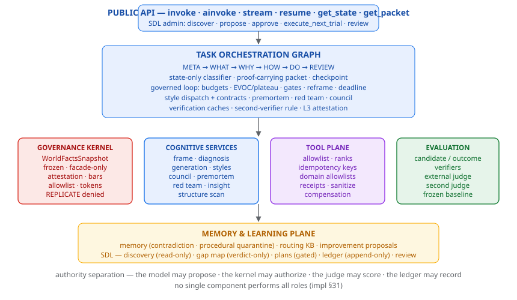

# Architecture (impl §5)



*Figure — the logical planes: public API over the governed task graph, with the kernel, cognitive, tool, evaluation, and memory/learning planes at distinct authority boundaries.*


## Logical planes

```
PUBLIC API (ThinkingAgent) — invoke · ainvoke · stream · resume · get_*
   │
TASK ORCHESTRATION GRAPH — META → WHAT → WHY → HOW → DO → REVIEW
   continuous VERIFY · state-only classifier · packet · checkpoint
   │
├── GOVERNANCE KERNEL — WorldFactsSnapshot (frozen), SafetyKernel,
│   budgets/LoopMonitor, attestation, PENDING allowlist, identity rules
├── COGNITIVE SERVICES — frame/diagnosis/generation, style passes + contracts,
│   council, premortem, red team, insight, structure scan
├── TOOL PLANE — allowlist, rank-checked tokens, idempotency, receipts,
│   sanitation, domain allowlists, compensation
├── EVALUATION PLANE — candidate/outcome verifiers, external judge,
│   second-judge escalation, frozen baseline
└── MEMORY & LEARNING — memory (contradiction, quarantine), routing KB,
    improvement proposals, SDL (discovery, gap map, plans, ledger, review)
```

## Observability (env-gated)

LangSmith tracing is OFF by default and activates only via
LANGSMITH_TRACING + LANGSMITH_API_KEY. The traced surface is the
structured audit material only — state snapshots, gate results, tool
receipts, the decision packet — never hidden reasoning (v8 §1.4).
The AuditService hashes content and the graph viewer script renders the
topology statically (scripts/view_graph.py).

## Trust boundaries (who may write what)

| Plane | May write | May never write |
|---|---|---|
| Task/model | graph state; proposals | kernel facts, KB, ledger, gap map, judge verdicts |
| Kernel | policy (operator) | — (read-only to everyone else) |
| Execution | tool receipts, idempotency | policy, learning state |
| Evaluation | verdicts, calibration | KB rates directly (judge pipeline only) |
| Persistent | ledger appends, gap entries, approved reviews | — (append-only) |

## The invariants in code

- **11** (KB from verdicts only): no task-plane module imports or writes the
  routing records; rates precompute from MEASURED records only.
- **12** (design records inert): `evidence_status=DESIGN` rows never enter
  rate computation or gap entries.
- **13** (ledger append-only): `Ledger.append` is hash-chained; only
  `JudgePipeline` holds it; `verify_chain()` recomputes every hash.
- **14** (plan gate): `execute_next_trial` raises on `DRAFT`.

## Key mechanics

- **Loop**: `loop_guard` enforces budgets (reserved epilogue), deadline,
  EVOC/plateau (wait-exempt), cognitive-call pricing per stage dispatch.
- **Routing**: learned IDF over KB triggers; mandatory protective modules
  per context; home-turf promotion; solo-contract micro-route detection.
- **Verification**: per-candidate cache (candidate+verifier+policy), outcome
  delta-cache, second-verifier rule kernel-computed, L3 at attestation.
- **Persistence**: LangGraph checkpointer (InMemory / SQLite owner-only);
  application state separated from kernel policy (YAML, signed in prod).
