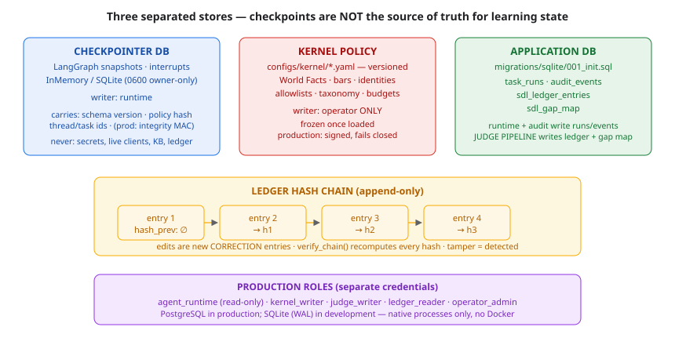

# Database Schema (impl §19)



*Figure — three separated stores (checkpointer, kernel policy, application DB) and the append-only ledger hash chain; production roles on separate credentials.*


## Separation (impl §19.2)

LangGraph checkpoints are NOT the source of truth for learning state.
Three stores coexist:

| Store | Content | Writer |
|---|---|---|
| Checkpointer DB (LangGraph) | graph snapshots, interrupts | runtime |
| Kernel policy (`configs/kernel/*.yaml`) | World Facts, versioned, signed in prod | operator |
| Application DB (`migrations/sqlite/001_init.sql`) | task runs, audit, ledger, gap map | per-table |

## Application tables (SQLite migration 001)

```sql
task_runs(task_id PK, thread_id, terminal_status, packet_json, created_at)
audit_events(event_id PK, task_id, stage, component, event_type,
             content_hash, created_at)
sdl_ledger_entries(sequence_number PK AUTOINCREMENT, entry_id UNIQUE,
                   entry_type, challenge_id, verdict, payload_hash,
                   hash_prev, hash, created_at)
sdl_gap_map(gap_id PK, signature_key UNIQUE, gap_type, magnitude,
            evidence_ref, last_updated)
```

Writers: `task_runs`/`audit_events` = runtime + audit service;
`sdl_ledger_entries` = judge pipeline ONLY (append-only at the app layer);
`sdl_gap_map` = judge pipeline ONLY (verdict-derived).

## Production (impl §9.4)

Separate database roles: `agent_runtime` (read-only facts),
`kernel_writer`, `judge_writer`, `ledger_reader`, `operator_admin`.
Kernel data lives in a separate file/store, read-only from the task process.

## Integrity

- Ledger hash chain recomputes per entry (`Ledger.verify_chain`).
- Checkpoints carry schema version, world-facts hash, thread/task ids
  (production adds an integrity MAC — Phase-1 boundary work).
- Secrets and live clients are never checkpointed (runtime context only).
