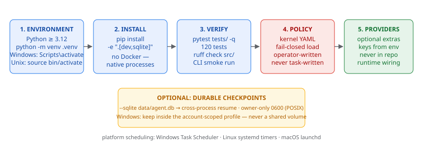

# Installation Guide



*Figure — the five installation steps, optional durable checkpoints, and the platform scheduling map.*


Thinking Agent v8 runs as a native Python package — **no Docker, no containers**
(impl §0.3). This guide covers Windows, Linux, and macOS.

## Requirements

| Component | Minimum | Notes |
|---|---|---|
| Python | 3.12 | 3.13 tested |
| pip | recent | `python -m pip install --upgrade pip` |
| SQLite | bundled with Python | checkpointer + application DB |
| Network | optional | only for live providers / arXiv discovery |

Provider integrations (DeepSeek, xAI, any OpenAI-compatible endpoint) are
optional extras and require API keys at runtime, never in the repository.

## Step 1 — Create a virtual environment

```bash
cd thinking_agent_v8
python -m venv .venv

# Windows:
.venv\Scripts\activate

# Linux / macOS:
source .venv/bin/activate
```

## Step 2 — Install the package

```bash
python -m pip install -e ".[dev,sqlite]"
```

- `dev` — pytest, Hypothesis, Ruff, coverage (tests and static quality)
- `sqlite` — `langgraph-checkpoint-sqlite` (durable checkpointer)

A locked installation via `uv` is supported; standard venv install remains
the reference path (impl §4.3: commit a lock file before release).

## Step 3 — Verify the installation

```bash
# the full validation suite (120 tests)
PYTHONPATH=src python -m pytest tests/ -q

# static quality
PYTHONPATH=src python -m ruff check src/

# one end-to-end run through the CLI
echo '{"task_id": "smoke", "input_text": "decide diagnose engineering"}' > task.json
PYTHONPATH=src python -m thinking_agent.cli run task.json \
  --policy configs/kernel/world_facts.development.yaml
```

Expected output is a JSON object with `status` (one of the eight terminal
states) and the proof-carrying `packet`. Without provider adapters wired,
cognitive calls fault-translate to a graceful state (typically
`NEEDS_EVIDENCE`) rather than crashing — that is correct behavior.

## Step 4 — Configure the kernel policy (operators)

Security-sensitive facts live in `configs/kernel/world_facts.*.yaml`:

- `world_facts.test.yaml` — deterministic test policy (small budgets, mock
  verifier identities)
- `world_facts.development.yaml` — development policy (real identity names,
  SDL disabled by default)

Startup **fails closed**: a missing, malformed, or unsigned (production)
policy aborts rather than inventing defaults (impl §9.2/§24.2). Values that
the v8 specification leaves to operators (`deadline_seconds`,
`pending_timeout_seconds`) are marked in the YAML.

## Step 5 — Configure providers (optional)

No provider packages are imported by the core. Wire adapters at runtime:

```python
from thinking_agent.providers.openai_compatible import OpenAICompatibleAdapter

adapter = OpenAICompatibleAdapter(
    api_key="sk-...",                       # environment variable, never code
    base_url="https://api.deepseek.com/anthropic",
    model="deepseek-v4-pro",
)
```

API keys come from environment variables or an OS secret store — never from
repository files (impl §24.3).

## Step 6 — Observability (optional)

```bash
# Windows PowerShell
$env:LANGSMITH_TRACING="true"
$env:LANGSMITH_API_KEY="lsv2_pt_..."
$env:LANGSMITH_PROJECT="thinking-agent-v8"
```

Off by default — no data leaves the machine until you opt in. The
traced surface is the structured audit material only (state, gates,
receipts, packet), never hidden reasoning (v8 §1.4). Local graph
views need no account: PYTHONPATH=src python scripts/view_graph.py

## Persistent checkpoints (optional)

```bash
PYTHONPATH=src python -m thinking_agent.cli run task.json --sqlite data/agent.db
```

The checkpointer DB is created with owner-only permissions (0600 on POSIX;
on Windows, keep it inside the account-scoped user profile — never on a
shared volume). Cross-process resume is supported: any agent instance with
the same `--sqlite` DB can inspect or resume a thread.

## Platform notes

| Platform | Activation | Scheduling (ops) |
|---|---|---|
| Windows | `.venv\Scripts\activate` | Task Scheduler |
| Linux | `source .venv/bin/activate` | systemd timers |
| macOS | `source .venv/bin/activate` | launchd |

See `docs/operations.md` for service startup, scheduled jobs
(pending-approval timeouts, SDL reviews, backups, ledger verification), and
backup/restore procedures.
