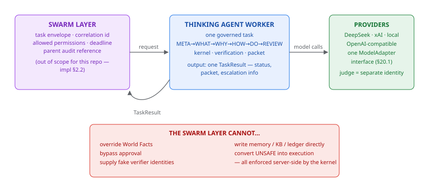

# Integration (impl §21.4)



*Figure — the swarm worker contract: one governed worker, one TaskResult, with the hard limits the external layer cannot cross.*


## Swarm worker contract

The Thinking Agent adapter behaves as ONE governed worker:

Input: task envelope (correlation id, allowed permissions, deadline, parent
audit reference). Output: one `TaskResult` with decision packet, status,
escalation info.

The external swarm layer CANNOT: override World Facts, bypass approval,
supply fake verifier identities, write memory/KB/ledger, or convert `UNSAFE`
into execution — all enforced server-side by the kernel.

## Provider integration (§20.1)

```python
from thinking_agent.api import ThinkingAgent
from thinking_agent.providers.openai_compatible import OpenAICompatibleAdapter

adapter = OpenAICompatibleAdapter(api_key=..., base_url="https://api.deepseek.com/anthropic",
                                  model="deepseek-v4-pro")
agent = ThinkingAgent(models={"main": adapter, "frame_builder": adapter,
                              "diagnostician": adapter, "generator": adapter,
                              "verifier": adapter, "outcome_verifier": adapter})
```

Judge independence (J3): use a DIFFERENT adapter identity for the judge role.

## Swarm-level orchestration

Out of scope for this repository (impl §2.2): bounded councils and parallel
style passes are internal parts of one governed task; multi-worker
orchestration lives in the external swarm layer.
