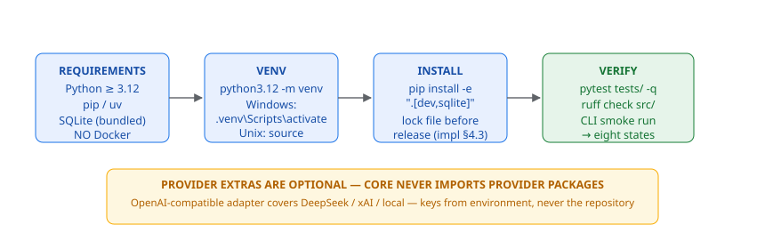

# Native Installation (impl §29.1)



*Figure — the native install flow: requirements, venv, install, verify — no Docker anywhere.*


```bash
python3.12 -m venv .venv
# Windows: .venv\Scripts\activate
source .venv/bin/activate
python -m pip install --upgrade pip
python -m pip install -e ".[dev,sqlite]"
```

Requirements: Python >= 3.12. No Docker. Provider extras are optional
(`providers` group). Exact transitive versions: commit a lock file before
release (impl §4.3).
