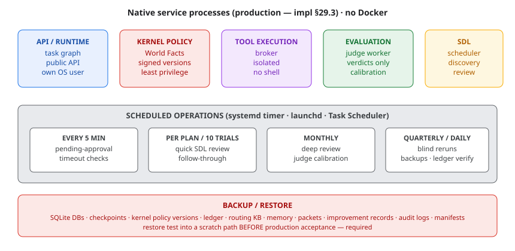

# Operations Runbook (native, no Docker — impl §29)



*Figure — production service processes, the scheduled-operations cadence, and the backup/restore requirement.*


## Start / stop (development profile)

```bash
cd thinking_agent_v8
PYTHONPATH=src python -m thinking_agent.cli run task.json \
  --policy configs/kernel/world_facts.development.yaml \
  --sqlite data/agent.db
```

- Single native Python process; no container required.
- Production services (impl §29.3): API/runtime, kernel policy service,
  tool execution service, evaluation worker, SDL scheduler — each a native
  process with its own OS user and least-privilege filesystem permissions.
- Windows: run under Task Scheduler; Linux: systemd timers; macOS: launchd.

## Scheduled operations (impl §29.4)

| Job | Cadence |
|---|---|
| Pending-approval timeout checks | every 5 min |
| Quick SDL review | per 10 trials / plan closeout |
| Deep SDL review | monthly |
| Judge calibration reminder | monthly |
| Blind corpus rerun | quarterly |
| Ledger integrity verification | weekly (`verify_hash_chain`) |
| Backups | daily |

## Optional observability (LangSmith)

Set LANGSMITH_TRACING=true + LANGSMITH_API_KEY (+ LANGSMITH_PROJECT) in
the API service environment to send run traces to LangSmith. Off by
default; the traced surface is the structured audit material only
(no hidden reasoning, §1.4). Graph topology renders locally via
scripts/view_graph.py without any account.

## Backup / restore (impl §29.5)

Back up: SQLite DBs (agent.db, checkpoints), `configs/kernel/` (World-Facts
versions), `data/` (registry, routing records, manifests), `docs` packets.

```bash
cp -r data configs/kernel backups/$(date +%F)/
```

Restore test MUST be performed before production acceptance: restore into a
scratch path, run `PYTHONPATH=src python -m pytest tests/ -q` plus one
`inspect --thread` against the restored DB.
