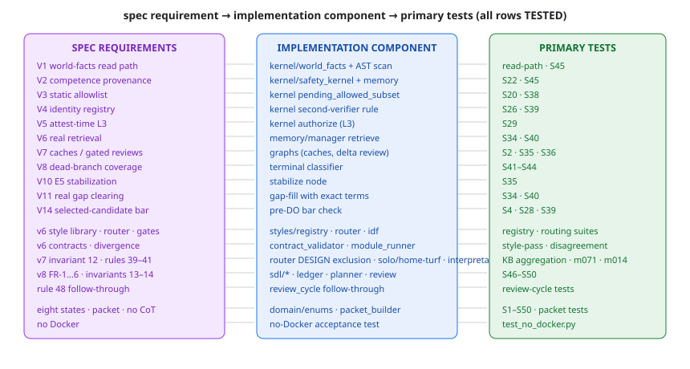

# Requirements Traceability Matrix

*Figure — the traceability map: spec requirement → implementation component → primary tests (all rows TESTED).*

Maps `thinking_agent.v8.md` requirements to implementation components and tests.
Status: `SPECIFIED` (in the plan) / `IMPL` (implemented) / `TESTED` (tests pass).

| Spec requirement | Component | Primary tests | Status |
|---|---|---|---|
| V1 world-facts read path | kernel/world_facts.py + runtime facade + AST assertion | read-path tests, S45 | TESTED |
| V2 competence provenance | review/competence.py (competence provenance gate lives in kernel/safety_kernel.py + memory/manager.py) | S22, S45 | TESTED |
| V3 allowlist (static table only) | kernel/safety_kernel.py (pending_allowed_subset) | S20, S38 | TESTED |
| V4 identity registry + second verifier | kernel/world_facts.py (verifier identities) + kernel/safety_kernel.py (second-verifier rule) | S26, S39 | TESTED |
| V5 attest-time L3 | kernel/safety_kernel.py (authorize: attestation, L3, REPLICATE) | S29 | TESTED |
| V6 real retrieval (priced hits) | memory/manager.py (retrieve, priced hits) | S34, S40 | TESTED |
| V7 caches + gated reviews | graphs/task_graph.py (outcome cache) + runtime/context.py (verification_cache), graphs/task_graph.py (delta_review) | S2, S35, S36 | TESTED |
| V8 dead-branch coverage | terminal/classifier.py | S41–S44 | TESTED |
| V10 E5 stabilization | graphs/task_graph.py (stabilize node) | S35 | TESTED |
| V11 real gap clearing | graphs/task_graph.py (real gap fill via memory retrieval) | S34, S40 | TESTED |
| V14 selected-candidate bar | verification/reliability.py | S4, S28, S39 | TESTED |
| v6 style library (104) | styles/registry.py | registry tests | TESTED |
| v6 learned router | styles/router.py + styles/idf.py | router validation | TESTED |
| v6 mandatory gates | styles/router.py (MANDATORY map) | routing tests | TESTED |
| v6 completion contracts | styles/contract_validator.py | style-pass tests | TESTED |
| v6 divergence resolution | styles/module_runner.py (divergence resolution) | disagreement tests | TESTED |
| v7 invariant 12 (design isolation) | styles/router.py DESIGN exclusion | KB aggregation tests | TESTED |
| v7 rule 39 solo-contract | styles/router.py (solo_contract_mode) | efficiency-route tests | TESTED |
| v7 rule 40 home-turf | styles/router.py promotion | m071 test | TESTED |
| v7 rule 41 interpretation pricing | planning/interpretation_pricing.py | m014 test | TESTED |
| v8 FR-1 discovery (read-only) | sdl/discovery.py + arxiv_source.py | S46 | TESTED |
| v8 FR-2 gap map (verdict-only) | sdl/gap_map.py | S47 | TESTED |
| v8 FR-3 curriculum planner | sdl/curriculum_planner.py | selection tests | TESTED |
| v8 FR-4 trials | api.py (execute_next_trial, anti-obsession rule) | trial tests | TESTED |
| v8 FR-5 ledger (append-only) | sdl/ledger.py + sdl/ledger.py (hash chain) | S48 | TESTED |
| v8 FR-6 review cycle | sdl/review_cycle.py | S50 | TESTED |
| v8 invariant 14 (plan gate) | domain/sdl.py (LearningPlan) + sdl/curriculum_planner.py | S49 | TESTED |
| v8 rule 48 follow-through | sdl/review_cycle.py | review tests | TESTED |
| Eight terminal states | domain/enums.py + terminal/ | S1–S50 | TESTED |
| Decision packet | domain/decision_packet.py | packet tests | TESTED |
| No raw chain-of-thought | packet schema contains no chain-of-thought fields; audit service hashes only | security tests | TESTED |
| No Docker | repo acceptance test | tests/test_no_docker.py | TESTED |
| Observability — metrics/audit/redaction, optional tracing | observability/audit.py + observability/tracing.py (env-gated LangSmith, §1.4 boundary) | api tests | TESTED |

*All rows TESTED — 121/121 tests (unit, routing, security, fault-injection, property, integration, evaluation, SDL S46–S50, S1–S45 44/44 port); legacy harness 187/187 + router 82.1%/97.2% reproducible; SDL pilot holds all invariants; release manifest (205+ files) + cost matrix generated; Ruff clean, 83% coverage. Updated 2026-08-13.*
