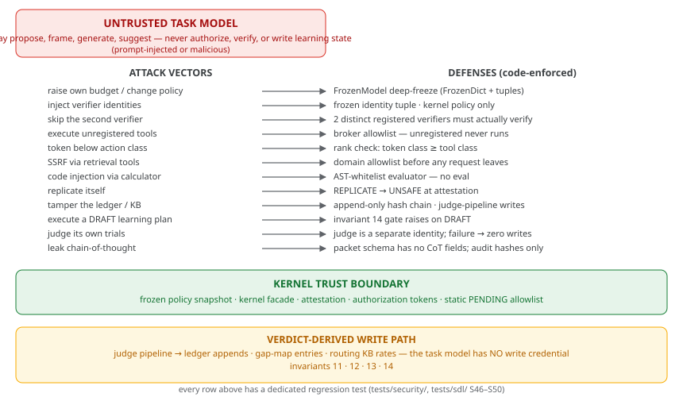

# Security Model (impl §5.2/§9/§16)

*Figure — attack vectors mapped to their code-enforced defenses, the kernel trust boundary, and the verdict-derived write path.*

## Threat model

The task model is UNTRUSTED with respect to security-sensitive values. A
malicious or prompt-injected model may try to: raise its own budget, inject
verifier identities, disable gates, write the routing KB or ledger, execute
unregistered tools, or exfiltrate via tool outputs.

## Countermeasures (all enforced by code, not prompts)

| Attack | Defense | Test |
|---|---|---|
| Mutate kernel policy | `FrozenModel` deep-freeze: FrozenDict + tuples at every nesting level; assignment/item/append all raise | security/test_security_regressions.py |
| Read knobs from task input | AST read-path scan (`kernel/policy_audit.py`) fails on request/state/config knob reads | test_read_path.py |
| Inject verifier identity | `verifier_identities` is a frozen tuple; identities accepted only from kernel policy | security regressions |
| Skip second verifier | Kernel-computed `second_verifier_required`; pre-DO block escalates | test_second_verifier_blocks_a3 |
| Execute unregistered tool | Broker allowlist: unregistered tools never run | test_unregistered_tool_never_executes |
| Token below class | Rank check: A-token must be >= tool class | test_token_class_below_required_blocks |
| Double execution | Idempotency keys; prior receipt returned | test_idempotency_never_double_executes |
| SSRF via retrieval | Domain allowlist checked BEFORE the handler; empty allowlist = no network | test_http_retrieval_requires_allowlisted_domain |
| Code injection via calculator | AST-whitelist evaluator (no eval; only Constant/BinOp/UnaryOp) | test_calculator_rejects_code |
| Replication | `REPLICATE` denied at attestation → UNSAFE | test_unsafe_on_replicate_tool |
| Silent execution skip | Missing broker with planned tasks → ESCALATED (never SOLVED) | test_broker_missing_escalates_not_skips |
| Ledger tamper | Append-only hash chain; edits are new CORRECTION entries | test_s48 + property test |
| Draft plan execution | Invariant 14 gate raises | test_s49 + api test |
| Judge self-dealing | Judge is a separate identity; judge failure → zero writes | test_judge_failure_produces_no_writes |
| Chain-of-thought leak | Packet schema has no CoT fields; audit hashes content only; LangSmith tracing is env-gated and carries the structured audit surface only | security suite |

## Residual disclosures (honest)

- Production policy signing (kernel_signature) is enforced at load but the
  signing key lifecycle is Phase-1 process-boundary work.
- The in-process kernel is a module boundary; the production split into
  separate processes/database roles is documented in docs/operations.md.
