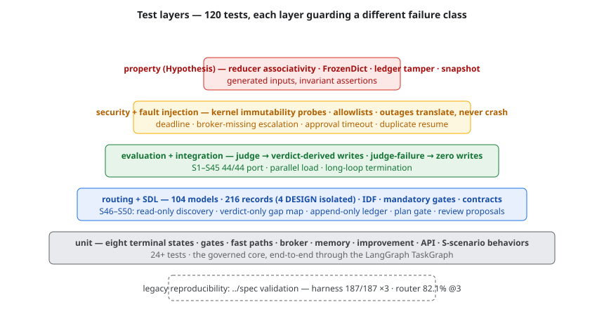

# Testing (impl §25)



*Figure — the test-layer pyramid: 120 tests across unit, routing/SDL, evaluation/integration, security/fault-injection, and property layers, with the frozen legacy harness underneath.*


## Layers

| Suite | What it proves |
|---|---|
| `tests/unit/` | eight terminal states end-to-end, gates, fast paths, broker, memory, improvement, API, S-scenario behaviors (E5 order, PENDING allowlist, real gap fill, self-rating rejection) |
| `tests/routing/` | 104-model registry validation, 216 records (4 DESIGN isolated), IDF routing, mandatory modules, home-turf promotion, solo-contract, contracts |
| `tests/security/` | kernel deep immutability probes, domain allowlist, second-verifier block, deadline, broker-missing escalation, reducer identity preservation |
| `tests/sdl/` | S46–S50: read-only discovery, verdict-only gap map, ledger append-only, plan gate, review proposals, rule-48 follow-through |
| `tests/evaluation/` | EvaluationEpisodeGraph: judge → verdict-derived writes; judge failure → zero writes |
| `tests/fault_injection/` | provider outages translate (never crash), verifier outage → L1 ladder, duplicate resume, oversized content, approval timeout |
| `tests/property/` | Hypothesis: reducer associativity, FrozenDict mutation rejection, ledger tamper detection, snapshot immutability |
| `tests/integration/` | long-loop termination at iteration ceiling, 10-way parallel load determinism |
| `tests/test_no_docker.py` | repository never contains container artifacts |
| LangSmith tracing (env-gated) | `test_langsmith_metadata_env_gated` — tracing OFF unless explicitly opted in; metadata carries only the audit surface |

## Historical reproducibility (impl §25.2)

```
cd ../spec && python validation/harness.py 3   # v4 177/177 · v5 187/187
python validation/style_router.py              # recall@3 82.1% · away 97.2%
```

The legacy harness remains frozen; the new implementation never modifies
historical results to pass.

## Running

```
PYTHONPATH=src python -m pytest tests/ -q          # 121 tests
PYTHONPATH=src python -m pytest tests/ --cov=thinking_agent   # 83%
PYTHONPATH=src python -m ruff check src/           # clean
```
