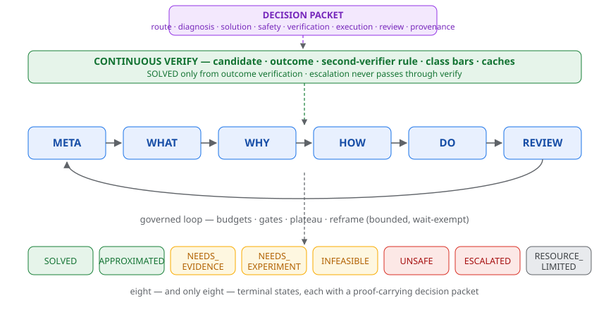
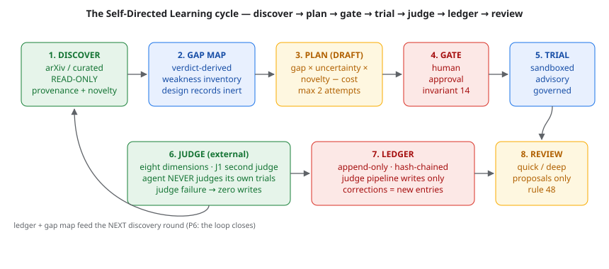

# User Guide



*Figure — the governed loop (META→WHAT→WHY→HOW→DO→REVIEW), the continuous verify band, and the eight terminal states with the proof-carrying packet.*


Thinking Agent v8 is a governed, stateful, auditable problem-solving system.
You submit a task; it runs the `META → WHAT → WHY → HOW → DO → REVIEW` loop
under a safety kernel and returns exactly one of **eight terminal states**
with a proof-carrying decision packet.

```
SOLVED · APPROXIMATED · NEEDS_EVIDENCE · NEEDS_EXPERIMENT
INFEASIBLE · UNSAFE · ESCALATED · RESOURCE_LIMITED
```

There is no "ERROR" state — internal faults are recovered, escalated, or
translated into one of the eight (impl §1.3).

---

## 1. Quick start (Python API)

```python
from thinking_agent.api import ThinkingAgent

agent = ThinkingAgent()  # development policy by default

result = agent.invoke({
    "task_id": "t-001",
    "input_text": "decide diagnose engineering",
})
print(result.status)                 # e.g. "SOLVED"
print(result.decision_packet.answer)
```

`ThinkingAgent` constructor options:

| Option | Purpose |
|---|---|
| `policy_path` | kernel policy YAML (default: development) |
| `models` | provider adapters per role (default: none — use mocks or wire adapters) |
| `sqlite_db` | durable checkpointer path (default: in-memory) |
| `registry_path` / `records_dir` | override the 104-model registry / 216 routing records |

## 2. Task surface

```python
agent.invoke(request)          # one governed run → TaskResult
agent.ainvoke(request)         # async variant
agent.stream(request)          # stage-by-stage event stream
agent.resume(thread_id, resp)  # answer a human-approval interrupt
agent.get_state(thread_id)     # inspect a checkpointed run
agent.get_packet(packet_id)    # retrieve a decision packet
```

**Human approval**: external actions at class A4/A5 (or explicitly
requested) pause on a `human_approval` interrupt. Resume with
`"approve"`, `"approve_with_edits"`, `"deny"`, `"escalate"`, or `"timeout"`.
Nothing executes without the approval path — there is no bypass.

## 3. CLI

```bash
# run one task
python -m thinking_agent.cli run task.json --policy <policy> [--sqlite db]

# inspect a checkpointed thread
python -m thinking_agent.cli inspect --thread <thread_id> --sqlite db
```

`task.json` accepts the `TaskRequest` fields; `task_metadata` carries
non-security hints (effort level, stakes, scenario keys for tests). Task
declarations are **never** trusted for security values — budgets, verifier
identities, and allowlists come exclusively from the kernel policy.

## 4. What the kernel protects you from

- The model cannot raise its own budget, inject verifier identities, or
  modify policy (deep-frozen World Facts).
- Unregistered tools never execute; tokens must meet the tool's action
  class; replication is always denied (`UNSAFE`).
- Retrieval tools require domain allowlists before any request leaves.
- The selected decision's verifier report — not the best in the set —
  governs the reliability bar; A3+ needs two independent verifier
  identities that actually verified it.
- The routing KB and the learning ledger are writable only by judge
  verdicts — never by the task model.

## 5. Self-Directed Learning (SDL)



*Figure — the Self-Directed Learning cycle: discovery, gap map, plan, human gate, trial, external judge, ledger, and review — closing the loop into the next round.*


SDL lets the agent plan its own practice — read-only discovery (arXiv,
curated feeds), a verdict-derived gap map, human-approved learning plans,
sandboxed trials, and an append-only hash-chained learning ledger.

```python
# discover challenge candidates (source adapter is read-only)
candidates = agent.discover_challenges(source, "strategy entry", budget=5)

# propose a plan — DRAFT plans cannot execute (invariant 14)
plan = agent.propose_learning_plan(candidates)
agent.approve_learning_plan(plan, approval_ref="me-001")

# run one trial
agent.execute_next_trial(plan)

# review (quick per-plan, deep monthly) — proposals only
report = agent.run_quick_review(candidate_pool=candidates)
```

Rules to remember: verdicts come from the external judge only; a trial
never judges itself; a challenge failing twice returns to review (the
anti-obsession rule); discovered-but-never-attempted candidates are
reported at every review boundary.

## 6. Reading the decision packet

Every run returns a `DecisionPacket` with sections: `route` (effort,
signature, routed styles, scores, confidence gate), `diagnosis`
(hypotheses, evidence, falsifiers, missing evidence), `solution`
(alternatives, selected decision, error bound), `safety` (declared vs
attested action class, authorization, risks, pending subset),
`verification` (candidate/outcome reports, reliability bar, identities),
`execution`, `review`, `resources` (iterations, calls, tokens, stop
reason), and `provenance` (policy version, model identities, prompt
versions, audit refs). No private chain-of-thought appears anywhere in it.

## 7. Running the validation suite

```bash
PYTHONPATH=src python -m pytest tests/ -q          # 120 tests
PYTHONPATH=src python -m pytest tests/ --cov=thinking_agent
PYTHONPATH=src python -m ruff check src/
```

The legacy control-flow harness and router validation remain reproducible
in `../spec/` (`python validation/harness.py 3` → 187/187;
`python validation/style_router.py` → 82.1% recall@3).

## 8. Observability with LangSmith (optional)

LangSmith visualizes the agent's runs: node-by-node graph execution, per-node
latency/tokens, checkpointed state snapshots, tool receipts, and run
metadata. It is **off by default** and env-gated:

```bash
set LANGSMITH_TRACING=true          # PowerShell: $env:LANGSMITH_TRACING="true"
set LANGSMITH_API_KEY=lsv2_pt_...   # from smith.langchain.com
set LANGSMITH_PROJECT=thinking-agent-v8
```

Then run the agent normally — every `invoke` attaches `task_id`,
`thread_id`, and `world_facts_version` as filterable metadata.

**The spec boundary (v8 §1.4):** what LangSmith may capture is exactly the
auditable surface — structured state, gate results, tool receipts, audit
events, and the decision packet. Private model chain-of-thought is never
produced by this implementation (structured outputs only) and never traced.
LangGraph Studio (the desktop GUI) additionally visualizes live state and
checkpoints against a running `langgraph-api` server.

Off by default means no data leaves the machine until you opt in.
